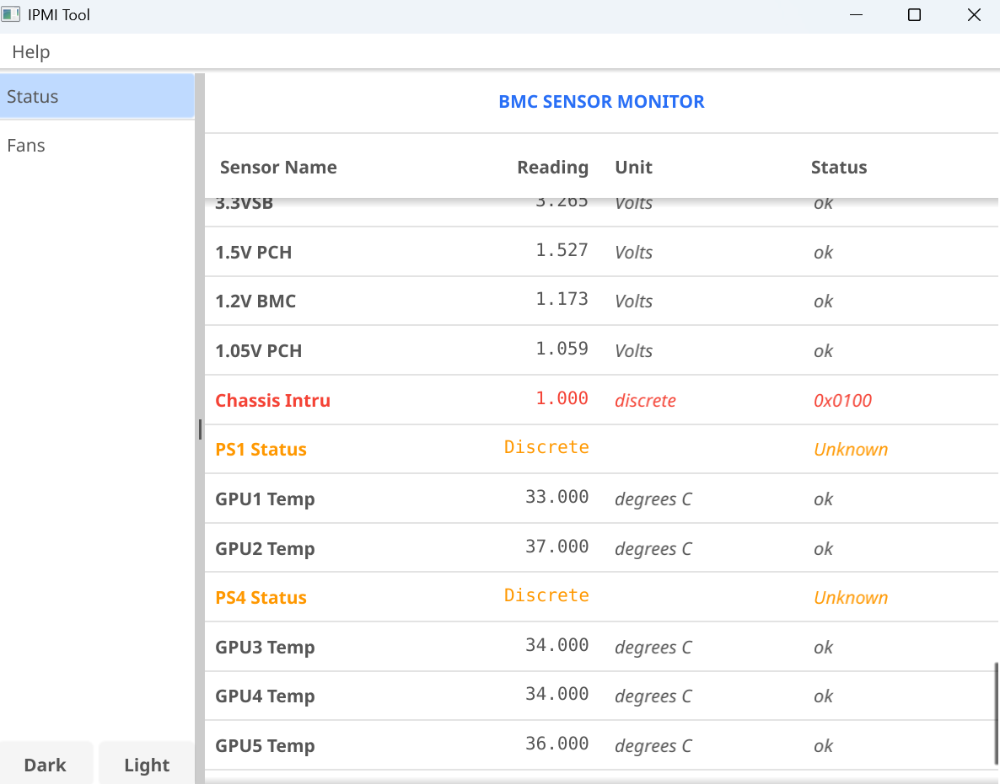
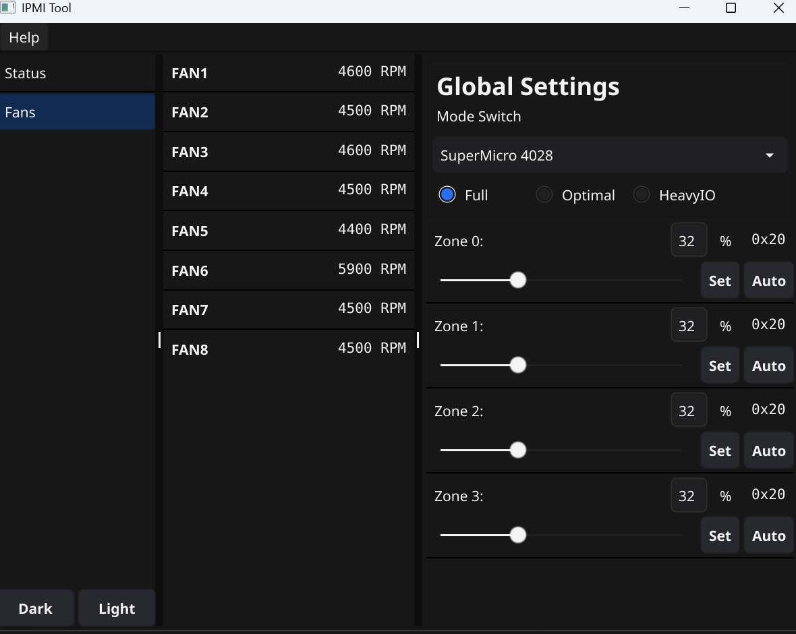

# IPMI Tool

This project's UI architecture is inspired by the [Fyne Demo](https://github.com/fyne-io/demo).
Special thanks to the Fyne.io developers for their amazing framework.
This product includes software developed by the Fyne.io developers (https://fyne.io).
The UI architecture is derived from the Fyne Demo project,which is licensed under the BSD 3-Clause License.

---

## What is this?

This is a lightweight, cross-platform IPMI management utility designed for real-time hardware monitoring and precision cooling control.

## Preview

*Real-time SDR monitoring with status indicators.*

*Precision 4-zone fan control for SYS-4028GR-TR.*

### Key Features:

* **SDR Monitor:** Real-time visualization of all Sensor Data Records (Fans, Temp, Voltage, etc.).
* **Thermal Management:** Quick switching between SuperMicro fan modes (Full, Optimal, HeavyIO).
* **4-Zone Precision Control:** Manual duty-cycle override for individual fan zones.

## Hardware Compatibility

**Note: Tailored for SYS-4028GR-TR.**

Currently, this tool is fully adapted and tested only on the **SuperMicro SYS-4028GR-TR** (since that's the only machine I own!).

* **For other SuperMicro servers:** You can still attempt to operate them using the "4028 mode," but **success is not guaranteed**.
* **Warning:** Manual fan control can lead to overheating if not monitored carefully. Use it at your own risk!

## Build from Source

If you prefer to build the binary yourself or need to package it for a specific platform (macOS, Linux ARM, etc.), please follow the official Fyne documentation:

👉 [Fyne Packaging Guide](https://docs.fyne.io/started/packaging/)

Note: Since this project uses CGO for graphics acceleration, ensure you have a proper C compiler (like gcc or MinGW-w64) installed on your system before running go build.

## License

By the way, you can use this code to do anything if you want.
